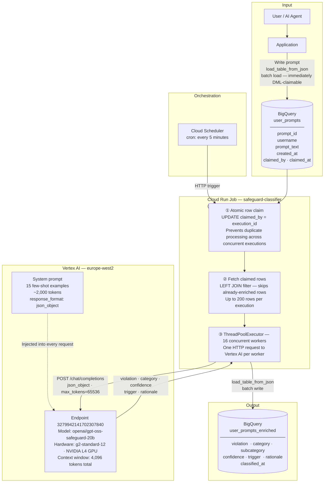

# Architecture — AI Prompt Safety Classifier

## End-to-End Pipeline



---

## Token Budget (4,096 total context window)

```
┌─────────────────────────────────────────────────────────────────────────────┐
│  4,096 tokens total                                                          │
├──────────────────────────────┬──────────────────────┬───────────────────────┤
│  System prompt               │  User input          │  JSON output          │
│  ~2,000 tokens               │  up to ~1,500 tokens │  ~80–120 tokens       │
│  (15 few-shot examples +     │  (6,000 char cap     │  violation · category │
│   safety policy)             │   enforced in code)  │  confidence · trigger │
└──────────────────────────────┴──────────────────────┴───────────────────────┘
```

---

## Data Flow — Step by Step

| Step | Component | What happens |
|------|-----------|--------------|
| 1 | Application | User prompt written to `user_prompts` via batch load |
| 2 | Cloud Scheduler | Fires an HTTP trigger every 5 minutes |
| 3 | Cloud Run Job | `UPDATE user_prompts SET claimed_by = execution_id` — atomic lock prevents two workers processing the same row |
| 4 | Cloud Run Job | `SELECT` back only the claimed rows; skip any already present in `user_prompts_enriched` |
| 5 | Vertex AI | Each of 16 workers sends one prompt as an OpenAI-compatible chat request; system prompt + user message fit within 4,096-token window |
| 6 | Vertex AI | Model returns structured JSON: `violation`, `category`, `subcategory`, `confidence`, `trigger`, `rationale` |
| 7 | Cloud Run Job | Results written to `user_prompts_enriched` via batch load (`load_table_from_json`) |

---

## Detection Categories

| Category | What it flags |
|---|---|
| `prompt_injection` | Instructions embedded in external content (documents, emails, data) attempting to override the AI |
| `jailbreak` | Attempts to bypass safety guidelines via personas, fictional framing, or mode activation |
| `red_team_recon` | Mapping the AI's refusal limits and safety boundaries |
| `red_team_bypass` | Soliciting advice on how to circumvent the AI's content policy |
| `red_team_probe` | Systematic threshold testing — escalating questions to find where refusals begin |
| `red_team_vuln` | Probing for known weaknesses in the model's safety training |
| `harassment` | Threats or targeted attacks against individuals |
| `hate_speech` | Slurs or hostility toward protected groups |
| `violence` | Content promoting or inciting physical harm |
| `illegal` | Requests for instructions relating to crimes or dangerous acts |

---

## Google Cloud Resources

| Resource | ID / Name | Details |
|---|---|---|
| Vertex AI Endpoint | `3279942141702307840` | Production — GPT-OSS-Safeguard-20b, g2-standard-12 + NVIDIA L4 |
| BigQuery Dataset | `coeus-sorites.safeguard` | Tables: `user_prompts`, `user_prompts_enriched` |
| Cloud Run Job | `safeguard-classifier` | `python ai_test.py --bigquery --limit 200`, 600s timeout |
| Cloud Scheduler | `safeguard-classifier-schedule` | `*/5 * * * *`, europe-west2 |
| Artifact Registry | `safeguard/classifier:latest` | `europe-west2-docker.pkg.dev/coeus-sorites/safeguard/classifier:latest` |
| Cloud Build | Staging bucket | `gs://coeus-sorites-cloudbuild-europe/source` |
| Cloud Run Job | `endpoint-manager` | Reads `ACTION` env var (`deploy`/`undeploy`), 1200s timeout |
